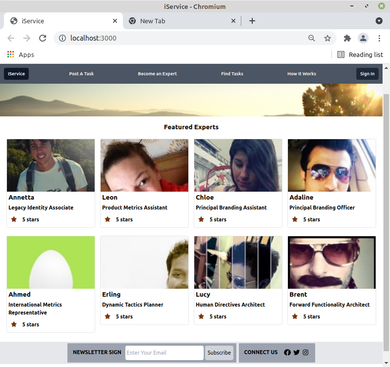

# iService Web App
> Bootsrapped with [Create React App][0]

## Packages and Libraries
* [Tailwindcss][1] - for styling
* [Faker][2] - for fake data
* [FontAwesome][3] - for icons 

## ScreenShots
||
|:--:|

[0]: https://github.com/facebook/create-react-app
[1]: https://tailwindcss.com/ 
[2]: https://www.npmjs.com/package/faker
[3]: https://fontawesome.com/